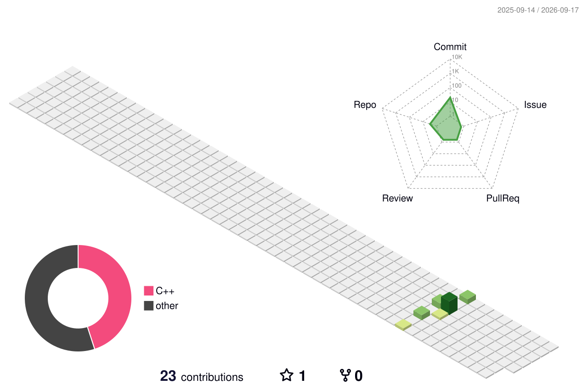

  <h1>
    
  </h1>

  

    <strong>Self-taught Programmer</strong> | <strong>Low-level Systems</strong> | <strong>Algorithm Enthusiast</strong>
  

  

    🔧 Passionate about understanding the bridge between hardware and software | 📚 Constantly learning | 💻 Open to collaboration
  

---

## 🚀 About Me

I'm a self-taught programmer deeply fascinated by how systems work at their core. I love diving into low-level programming, exploring data structures, and optimizing code for performance. My journey is centered around understanding memory management, kernel exploration, and building efficient software architectures.

When I'm not coding, you'll find me researching algorithms or experimenting with system-level optimizations on Linux environments.

---

## 🛠️ Tech Stack

### like Languages

  

### Tools & Environments

   

### Core Interests
- 🧠 Memory Management & Optimization
- 🔗 Non-linear Data Structures (AVL Trees, BSTs, Heaps)
- 🐧 Kernel Exploration & System Programming
- ⚡ Performance Analysis & Benchmarking
- 🏗️ Software Architecture & Design Patterns

---

## 🖥️ 3D Memory & System Architecture Grid 🏗️

  
  <!-- مجسم ثلاثي الأبعاد مخصص يحاكي الـ Stack/Heap للذاكرة -->
  
  
  
<i>💾 Visualizing code commits as 3D memory blocks allocated on the heap! ⚡</i>

---

## 📊 GitHub Statistics

  
  
  
  

---

## 💡 What I'm Currently Exploring

- 🎯 Advanced C++ optimizations and templates
- 🔬 Data structures implementations & performance benchmarking
- 🏗️ Building robust, scalable software systems
- 🚀 Edge AI development with TensorFlow Lite & ONNX Runtime
- 📖 Computer Systems & architecture deep-dives

---

## 📫 Connect With Me

  
  

  
  
⭐ If you find my projects interesting, feel free to star them! 🚀

  
  

